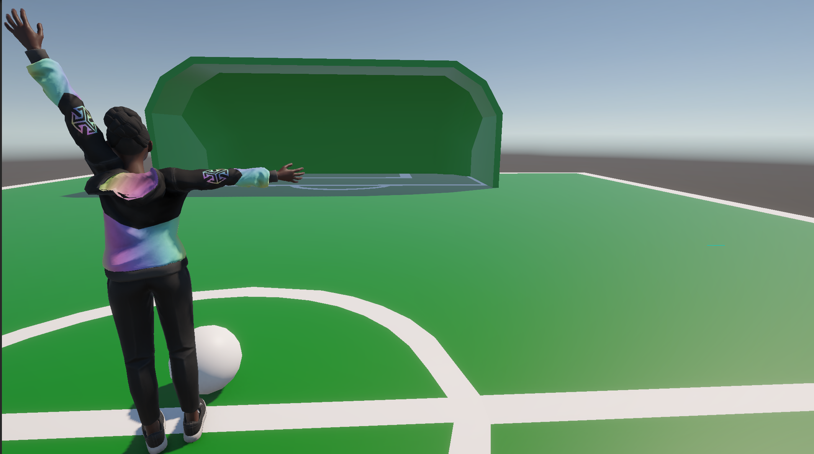
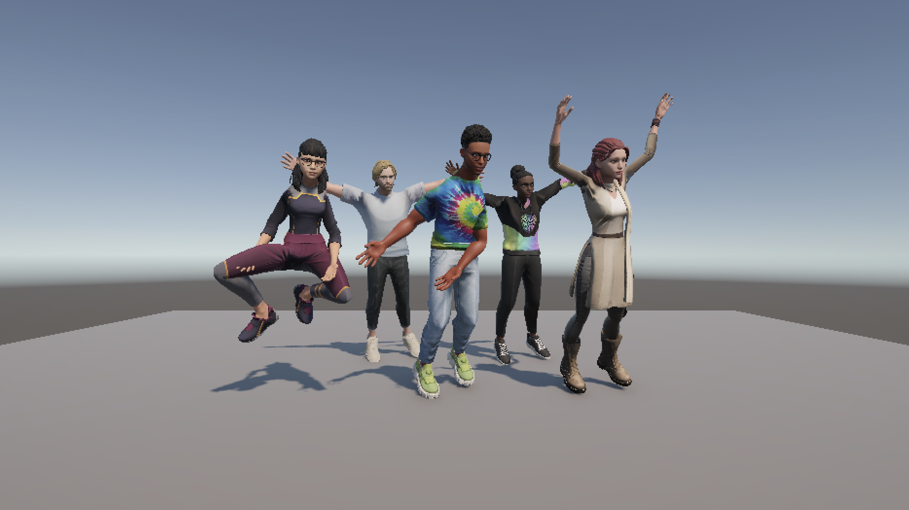

#  UPose - AI motion tracking in Unity

UPose is a Unity resource that utilizes different AI methods for human motion tracking and demonstrates its capabilities in a gallery of sample applications.
You can use the UPose framework as a setup for your own projects, as an experimental setup for human-computer interaction research, or even as instructional material for courses that involve movement, media, and machines. 
### Features
- 🦾 MediaPipe human motion tracking
- 🦿 MMPose human motion tracking
- 💻 Simple API for accessing human pose data
- 🧍 Standard Human IK skeleton support
- ⌨️ Real-time data streaming from Python to Unity
- 🏃 Several interactive demos included

## 📔 Contents
### Demo 1 - 🏃‍♂️ Exercise Room
In this demo the user must complete an exercise routine with hip adbuctions and elbow flexions. Scene: `ExerciseScene.unity`


### Demo 2 - ⚽ Soccer
In this demo the user kicks a soccer ball in a soccer stadium. Scene: `SoccerScene.unity`



### Demo 3 - 🏹 Archer
In this demo, the user must shoot the target hanging from the tree by mimicking an archer.


### Demo 4 - 🕺 Dance Scene
In this scene you dance with four other avatars that mimic your moves on their own pace. Scene: `DanceScene.unity` 



### Demo 5 - 🏞️ Interactive Waterfall
Where motion meets water, each movement sparks a shimmer of falling light. Scene: `Waterfallscene1.unity`


### Demo 6 - 🏏 CatchBall
Use both hands to control a platform to catch the ball into the basket!


## Unity C# Example
UPose API is simple and easy to use in C# in Unity. Here is a 3-line example that shows how to get a bone rotation from the motion tracker and apply it to an avatar.

```csharp
MotionTrackingPose pose = FindFirstObjectByType<MotionTracking>();

//Get right fore arm rotation
Quaternion rotation=pose.GetRotation(Landmark.LEFT_ELBOW);

//Apply the rotation to your avatar
LeftForeArm.localRotation=rotation;
```

## Prerequisites

The motion tracking methods are implemented in Python and stream the data to Unity. 
In addition to installing Unity and Python, please refer to the installation guide for additional requirements of specific motion tracking libraries.


## Installation

### MediaPipe
The mediapipe tracking works in Python. It is recomended that you install miniconda, a minimal version of Anaconda, in order to keep the python setup of this project separate from other python installations in your computer. https://www.anaconda.com/docs/getting-started/miniconda/install

After installation you need to use the terminal and run from the folder `miniconda3/bin` or `miniconda3/Library/bin` the following:
```
conda init
```

You can verify your miniconda installation by:
```
conda --version
```

Then you can create a new environment for the mediapipe setup:
```
conda create -n mediapipe python=3.9
conda activate mediapipe
```

Then you can install the dependencies of this project:
```
pip install opencv-python mediapipe
```

Finally to run mediapipe go into the folder `MotionCapture/mediapipe` and run:
```
python main.py
```
This program will attempt to connect to Unity and stream the motion capture data to your Unity project. Keep the python program running and start the UPose Unity project to see the motion capture data in action!

### MMPose
```
conda create --name openmmlab python=3.8 -y
conda activate openmmlab
```


## Credits

### Assets
- Solder.glb - MIT License - https://github.com/mrdoob/three.js/blob/dev/examples/models/gltf/Soldier.glb
- avatar.glb - CC-NC-SA 4.0 - https://github.com/Surbh77/AI-teacher/blob/main/avatar.glb
- avatar1.glb - CC-NC-SA 4.0 - https://github.com/Surbh77/AI-teacher/blob/main/avatar1.glb
- 67d411b30787acbf58ce58ac.glb - CC-NC-SA 4.0 - https://models.readyplayer.me/67d411b30787acbf58ce58ac.glb
