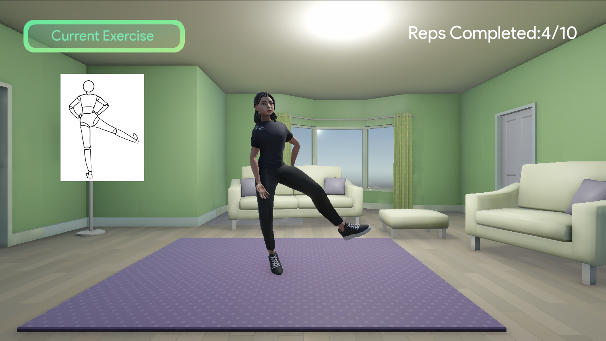
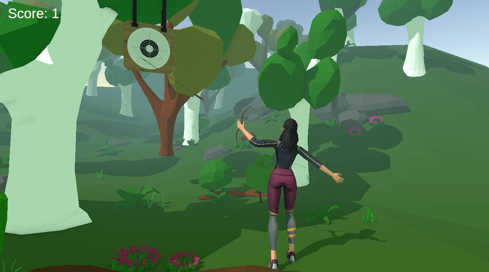
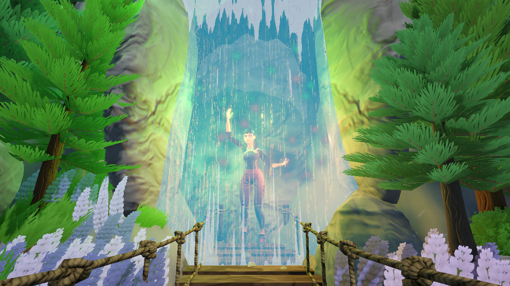
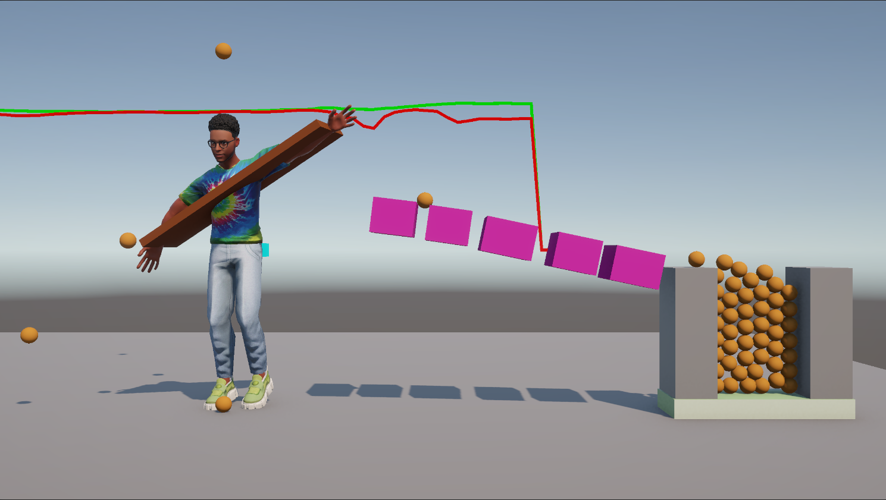

# UPose - A framework for camera-based motion tracking in Unity

UPose is a useful resource that utilizes different methods of human motion tracking in Unity and demonstrates its capabilities in different sample demo applications.
The UPose repository currently supports MediaPipe and MMPose for motion tracking. 

## Contents
### Demo 1 - Exercise Room
In this demo the user must complete an exercise routine with hip adbuctions and elbow flexions. Scene: `ExerciseScene.unity`



### Demo 2 - Soccer
In this demo the user kicks a soccer ball in a soccer stadium. Scene: `SoccerScene.unity`


### Demo 3 - Archer
In this demo, the user must shoot the target hanging from the tree by mimicking an archer.



### Demo 4 - Hitting Targets
Brief desciption and screenshot

### Demo 5 - Interactive Waterfall
Where motion meets water, each movement sparks a shimmer of falling light.



### Demo 6 - CatchBall
Use both hands to control a platform to catch the ball into the basket!


## Prerequisites

The motion tracking methods are implemented in Python and stream the data to Unity. 
In addition to installing Unity and Python, please refer to the installation guide for additional requirements of specific motion tracking libraries.


## Installation

### MediaPipe
The mediapipe tracking works in Python. It is recomended that you install miniconda, a minimal version of Anaconda, in order to keep the python setup of this project separate from other python installations in your computer. https://www.anaconda.com/docs/getting-started/miniconda/install

After installation you need to use the terminal and run from the folder `miniconda3/bin` or `miniconda3/Library/bin` the following:
```
conda init
```

You can verify your miniconda installation by:
```
conda --version
```

Then you can create a new environment for the mediapipe setup:
```
conda create -n mediapipe python=3.9
conda activate mediapipe
```

Then you can install the dependencies of this project:
```
pip install opencv-python mediapipe
```

Finally to run mediapipe go into the folder `MotionCapture/mediapipe` and run:
```
python main.py
```
This program will attempt to connect to Unity and stream the motion capture data to your Unity project. Keep the python program running and start the UPose Unity project to see the motion capture data in action!

### MMPose
```
conda create --name openmmlab python=3.8 -y
conda activate openmmlab
```


## Credits

### Assets
- Solder.glb - MIT License - https://github.com/mrdoob/three.js/blob/dev/examples/models/gltf/Soldier.glb
- avatar.glb - CC-NC-SA 4.0 - https://github.com/Surbh77/AI-teacher/blob/main/avatar.glb
- avatar1.glb - CC-NC-SA 4.0 - https://github.com/Surbh77/AI-teacher/blob/main/avatar1.glb
- 67d411b30787acbf58ce58ac.glb - CC-NC-SA 4.0 - https://models.readyplayer.me/67d411b30787acbf58ce58ac.glb
