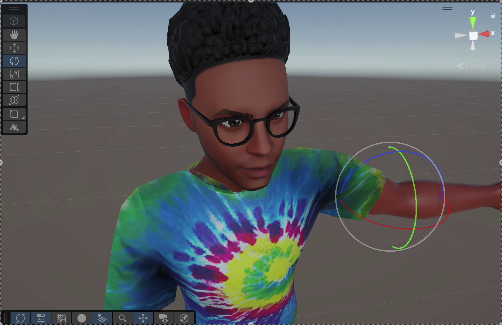
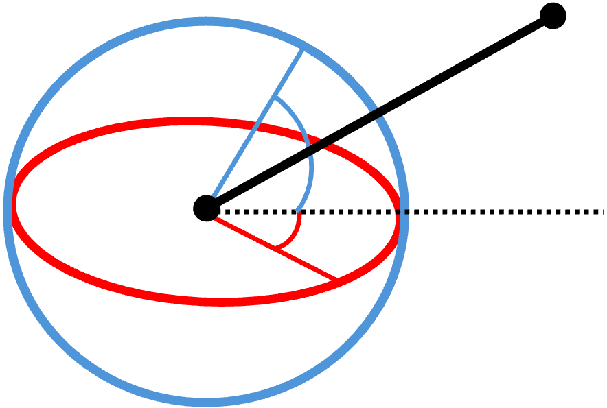

# How UPose.py calculates joint angles from mediapipe data
This tutorial explains how to calculate joint angles from the x,y,z coordinates of a human skeleton such as the world coordinates produced by mediapipe. 

### Why do I need joint angles?
- Joint angles are representing a local rotation that is needed for animating avatars.
- They are also good posture descriptors because they are indicating how much an elbow is bent for example.
- Finally, they are also consistent for the same posture accross different people and they are location invariant.

### How many angles are in each joint?
- In each joint there is a local coordinate system, therefore we could rotate around x, y, and z, which are the three Euler angles.
- The image below shows the local coordinate system of an elbow, where the trajectory around x is shown in red, around y in green, and arouns z in blue. 

- Note that each joint has a different coordinate system. In this example, in the coordinate system at the elbow the y axis appears to be horizontal, while the x axis is vertical, and z is in-out. 

### Can I calculate all three angles in each joint?
- No. One angle corresponds to the rotation of twisting the bone, and in most of the cases the x,y,z coordinates are not enough to describe this angle.
- For example in the image above, a rotation around the green circle corresponds to twisting the forearm, which may not be clear from just the x,y,z coordinates provided by mediapipe.

### How to calculate the other two angles?
A rotation around z is expressed as:
$`
R_z(\psi) = 
\begin{bmatrix}
\cos\psi & -\sin\psi & 0 \\
\sin\psi & \cos\psi & 0 \\
0 & 0 & 1
\end{bmatrix}
`$

and a rotation around x is expressed as:
$`
R_x(\phi) = 
\begin{bmatrix}
1 & 0 & 0 \\
0 & \cos\phi & -\sin\phi \\
0 & \sin\phi & \cos\phi
\end{bmatrix}
`$

The order of rotations in Unity is ZXY which means that the total rotation would be $`R = R_y(\theta) \cdot R_x(\phi) \cdot R_z(\psi)`$ so in our case would be 
$`
R = R_x(\phi) \cdot R_z(\psi) =
\begin{bmatrix}
1 & 0 & 0 \\
0 & \cos\phi & -\sin\phi \\
0 & \sin\phi & \cos\phi
\end{bmatrix}
\cdot
\begin{bmatrix}
\cos\psi & -\sin\psi & 0 \\
\sin\psi & \cos\psi & 0 \\
0 & 0 & 1
\end{bmatrix} =
\begin{bmatrix}
\cos\psi & -\sin\psi & 0 \\
\cos\phi \sin\psi & \cos\phi \cos\psi & -\sin\phi \\
\sin\phi \sin\psi & \sin\phi \cos\psi & \cos\phi
\end{bmatrix}
`$

The angle $`\phi`$ corresponds to the rotation around x, shown in red in the following figure, and angle $`\psi`$ corresponds to the rotation around z, shown in blue.

If we apply this rotation to the vector $`\begin{bmatrix}
0 \\ 1 \\ 0
\end{bmatrix}`$, which corresponds to the orientation of the bone without rotation, then we have the following parametric model $`
\begin{bmatrix}
-\sin\psi \\
\cos\phi \cos\psi \\
\sin\phi \cos\psi
\end{bmatrix}
`$. This can be used to calculate the angles $`\phi`$ and $`\psi`$ from the local direction of the bone as follows:
$`
\begin{bmatrix}
-\sin\psi \\
\cos\phi \cos\psi \\
\sin\phi \cos\psi
\end{bmatrix} = 
\begin{bmatrix}
d_x \\ d_y \\ d_z
\end{bmatrix}
`$. Therefore, $`\psi = \arctan2(-d_x, d_y)`$ and $`\phi = \arctan2(d_z, d_y)`$.
